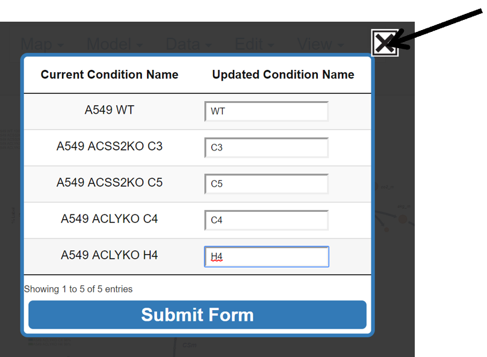

# 7. Edit the Data
This portion of the guide explains how to edit how data files are organized. Specifically it will show how to alter the order in which groups are presented in graphs, data files are included in conditions, as well as explain how to rename conditions. 

## 7.1 Reorder Conditions
This button allows the user to select which conditions to graph and the order the conditions will appear in each graph.

### 7.1.0 Make Organize Conditions Pop-up Appear

Click **Reorder Conditions**.

{: style='width:200px' }

After Click:

{: style='width:550px' }

### 7.1.1 Organize Conditions
Left click and drag the condition below **To Graph** and let go:

{: style='width:550px' }
 
Continue arranging conditions under **To Graph**, until the desired conditions are included in the correct order. The blue rectangle shows where the current condition will be placed.

{: style='width:550px' }
 
### 7.1.2 Submit or Abort Changes
Submit changes by left clicking **Submit**. Abort changes by clicking the X in the top right.

Submit:

{: style='width:550px' }
 
Before Submit:

{: style='width:650px' }
 
After Submit:
 
{: style='width:650px' }

Abort:

{: style='width:550px' }

## 7.2 Reorder Files
This button allows the user to reorganize their data files into new groups.

### 7.2.0 Make Reorder Files Pop-up Appear
Click **Reorder Files**:

{: style='width:200px' }
 
After Click:

 
Now files can be organized as described [here.](../GettingStarted/#145-organize-groups)
## 7.3 Edit Condition Names
This button allows the user to change the name of the conditions included in the Escher-Trace graphs.

### 7.3.0 Make Edit Condition Names Pop-up Appear
Click **Edit Condition Names**:

{: style='width:200px' }
 
After Click:

{: style='width:400px' }
 
### 7.3.1 Update Condition Name
Left click on the white box next to the current condition name and type the new desired name. 

{: style='width:400px' }
 
### 7.3.2 Submit or Abort Changes
Click on **Submit Form** to submit changes and left click on the X in the top right to abort changes. After submission, Escher-Trace graphs will be updated with the new condition names.

Submit:

{: style='width:400px' }
 
Before Submit:

{: style='width:650px' }
 
After Submit:

{: style='width:550px' }
 
Abort:

{: style='width:470px' }
