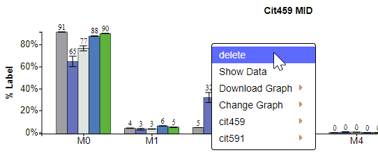
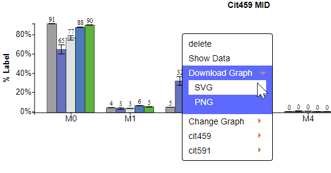

# 2. Edit individual graphs
This section of the documentation explains how individual Escher-Trace graphs can be edited, downloaded, or used to access additional data associated with the graphed metabolite. Additionally, a walkthrough of how to edit title and y-axis label text is presented. These processes apply to all Escher-Trace graphs, not just the ones shown below.

## 2.1	Access Additional Graph Options

The context menu of each Escher-Trace graph allows users provides several functions to users including **Delete**, **Show Data**, **Download**, **Change Graph**, as well as entries for all fragments associated with the selected metabolite which allow you to access data from these fragments. Selection of any of these functions apply to only the selected Escher-Trace graph. 
Escher-Trace graphs. There are two methods to access Escher-Trace graph context menus.

**Method 1:** Left click on the menu triangle located in the top left hand corner of all graphs

Before clicking context button:

{: style='width:500px' }

After clicking context button:
 
{: style='width:500px' }

**Method 2:** Right click anywhere on a graph

After right clicking on a graph:

{: style='width:500px' }

To get rid of the dropdown menu simply click away from the graph and menu.

## 2.2	Delete Graph
To delete a graph from the Escher-Trace workspace, click on **delete** after making the dropdown menu appear.

{: style='width:400px' }

No data is deleted by selecting this option.
 
## 2.3	Show Data
To view that data used to generate an Escher-Trace graph click on **Show Data**.

{: style='width:350px' }
 
After Click:

 

Scroll through the data using the bar at the bottom of the table:

Copy the Table:

 
Close the Table: 
 
 
 
 
## 2.4	Downloading an Individual Graph
To download an individual Escher-Trace graph click **Download** then select the file type you want to download the graph as. The options are **SVG** or **PNG**.
 
 {: style='width:400px' }
 
## 2.5	Change Graph Aesthetics
To edit the aesthetics of an individual Escher-Trace graph, click **Change Graph**. Additional options will appear allowing you to change the size and color scheme of the individual graph.

### 2.5.1	Change Graph Size
Click on **Size** to make the Graph Size pop-up appear.

{: style='width:400px' }

Interact with the Graph Size pop-up as described [here.](../GraphAttributes/#41-changing-size)

### 2.5.2	Change Graph Color Scheme
Click on **Color** to make the Color Scheme pop-up appear.

 {: style='width:400px' }

Interact with the Color Scheme pop-up as described [here.](../GraphAttributes/#42-changing-graph-color-scheme)
 
## 2.6	Access Additional Data Types
The remaining entries in the Escher-Trace graph context menu allow for access to all other graphs and data types of a metabolite. To view available data types, simply click on the metabolite/fragment name. Additional graphs can be generated by clicking on the desired graph type.

{: style='width:400px' }
 
After Click:
 
 {: style='width:400px' }

## 2.7	Changing Graph Title or Y-axis Label
The text of every Escher-Trace graph title and y-axis label can be edited by simply hovering and then clicking over thet title or y-axis label text.

Before Hover:

{: style='width:400px' }

After Hover:

{: style='width:400px' }

After Click:

{: style='width:400px' }
 
Change the text in the text input. Move through the text input with arrow keys and delete with backspace. When the desired name is entered press enter.

## 2.8	Generating Graphs for Individual Isotopologues
There are two methods to generate graphs of specific isotopologues (e.g M0, M1, etc.)

**Method 1:** Click on the desired isotopologue on the x-axis, for M0 click M0.

**NOTE:** This option is only available for MID and abundance graphs.

When Hovering:

{: style='width:400px' }

**Method 2:** Access individual isotopologues from the context menu of any Escher-Trace graph.

{: style='width:400px' }

After Click:
 
{: style='width:400px' }

## 2.9	Moving the Graphs
To move the graph in Escher-Trace, hover over the graph, then click and drag to desired location.
