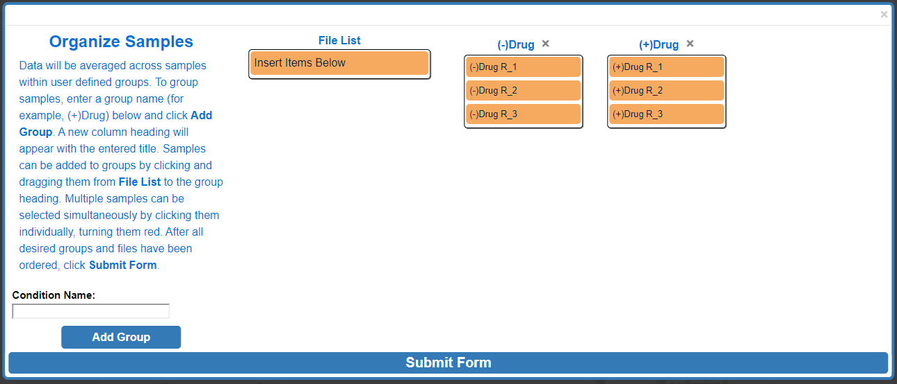
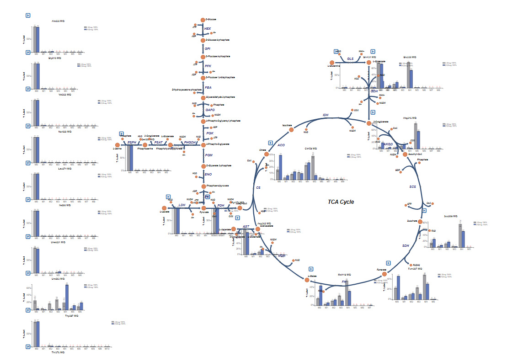

# 1. Getting Started with Escher-Trace
## 1.1 Introduction
Escher-Trace simplifies the process of analyzing stable isotope tracing data by generating publication quality graphs of isotope tracing data on top of a metabolic map. The goal of this visualization tool is to make tracing data more accessible by improving data presentation and streamlining analysis.

Stable isotope tracing is a technique used to gain insight about intracellular metabolic fluxes by tracking the passage of an labeled isotopes through metabolic pathways. By applying a stable isotope labeled metabolite to a cell or in vivo system, insight into how that metabolite is catabolized can be made by analyzing where the heavy isotopes go.

## 1.2	Integration with Escher
Escher is a web application for visualizing metabolic pathway maps. More information about what Escher is and how to use it can be found in the <a href="https://escher.readthedocs.io/en/stable/getting_started.html"> Escher Guide</a>. Escher-Trace allows users to overlay metabolic tracing data on top of Escher maps. Because Escher-Trace is built on top of Escher, users have full access to all of Escher's features including loading, saving, and editing metabolic maps. 

### 1.2.1	Escher-Trace Metabolic Maps
A number of maps are available through the Escher, in order to understand how to access and upload maps see the<a href="https://escher.readthedocs.io/en/stable/getting_started.html"> Escher Guide </a>.

 
## 1.3	Importing Tracer Data

### 1.3.1	Data Format
Baseline corrected mass spectrometer labeling data can be imported into Escher-Trace in CSV format. If the data has not been corrected for natural isotope abundance, Escher-Trace can apply the correction using the algorithm proposed by Fernandez et. al.1 Additional information on natural isotope abundance correction in Escher-Trace can be found [here.](../Calculations/#91-natural-isotope-abundance-correction)

#### 1.3.1.1	Example Data Files

Natural Isotope Uncorrected [CSV File](./example_files/Escher-Trace Uncorrected Example Data File.csv)

Natural Isotope Corrected [CSV File](./example_files/Escher-Trace Corrected Example Data File.csv)

#### 1.3.1.2	Natural Isotope Uncorrected CSV Format
Uncorrected tracing data can be imported into Escher-Trace in the following CSV format:

| Metabolite | Formula     | Fragment   | Sample 1 | Sample 2 | Sample 3 |
|------------|-------------|------------|----------|----------|----------|
| pyr_c      | C6H12O3N1Si | pyr174(M0) | 64400    | 62200    | 50400    |
|            |             | pyr175(M1) | 17300    | 16700    | 16800    |
|            |             | pyr176(M2) | 32200    | 29900    | 21802    |
|            |             | pyr177(M3) | 1000000  | 975000   | 728237   |
| lac__D_c   | C10H25O2Si2 | lac233     | 316000   | 276000   | 193000   |
|            |             | lac234     | 189244   | 155819   | 126226   |
|            |             | lac235     | 7073389  | 7100000  | 5090000  |
| lac__D_c   | C11H25O3Si2 | lac261     | 1060000  | 750924   | 703000   |
|            |             | lac262     | 253442   | 178834   | 166985   |
|            |             | lac263     | 110000   | 76515    | 70800    |
|            |             | lac264     | 17400    | 14300    | 12548    |

**Note**: For each metabolite/fragment, the number of isotopologues to include abundances of should be as close to the total number of possible labeled states from the applied tracer as possible, without compromising the purity of the metabolite peak integration.

Important formating details for uncorrected data:

+ The first row of the CSV must include the following headings in order: **Metabolite**, **Formula**, **Fragment** followed by the **sample names**
+ **Metabolite** and **Fragment** entries should only use alpha-numeric characters, non-alpha-numeric characters will be replaced with underscores ("_") by Escher-Trace.
+ Entries in **Metabolite** and **Formula** columns indicate that data for a new fragment is being entered, thus only include these entries in rows containing your unlabeled (M0) counts. The entry in the Fragment column of these rows is used as the identifier for the  fragment as well as for graph titles in Escher-Trace.
+ If including data measured from multiple fragments for the same metabolite, simply enter the same **Metabolite name** for all fragments.
+ The isotopologue '(M#)' does not need to be included in fragment name, the first row of data for each fragment is assumed to be M0, the second M1, and so on.
+ Chemical formulas must be entered in in empirical format, absent of any non alpha-numeric characters (such as "()", "{}", etc.).
+ Isotopologue counts should be baseline corrected inorder to obtain accurate corrected labeling distributions.
+ Inorder to have data appear next to specific escher metabolite node, use the bigg_ID of the desired metabolite node as the metabolite name. 
  
#### 1.3.1.3	Natural Isotope Corrected CSV Format
  
Tracing data that has already been corrected for natural isotope abundance be imported into Escher-Trace in the following CSV format:

| Metabolite | Fragment   | Sample 1 | Sample 2 | Sample 3 |
|------------|------------|----------|----------|----------|
| pyr_c      | Abundance  | 118000   | 104000   | 91400    |
|            | pyr174(M0) | 0.689    | 0.529    | 0.599    |
|            | pyr175(M1) | 0.234    | 0.328    | 0.288    |
|            | pyr176(M2) | 0.068    | 0.073    | 0.081    |
|            | pyr177(M3) | 0.008    | 0.027    | 0.017    |
| lac__D_c   | Abundance  | 8350000  | 6520000  | 5970000  |
|            | lac233     | 0.756    | 0.753    | 0.755    |
|            | lac234     | 0.162    | 0.163    | 0.162    |
|            | lac235     | 0.069    | 0.07     | 0.07     |
| lac__D_c   | Abundance  | 13300000 | 10300000 | 9510000  |
|            | lac261     | 0.744    | 0.743    | 0.746    |
|            | lac262     | 0.17     | 0.169    | 0.169    |
|            | lac263     | 0.072    | 0.072    | 0.072    |
|            | lac264     | 0.011    | 0.013    | 0.011    |

Important formating details for corrected data:

+ The first row of the CSV must include the following headings in order: **Metabolite**, **Fragment** followed by the **sample names**
+ **Metabolite** and **Fragment** entries should only use alpha-numeric characters, non-alpha-numeric characters will be replaced with underscores ("_") by Escher-Trace.
+ Entries in **Metabolite** column indicate that data for a new fragment is being entered, thus only include these entries in rows containing your fragment abundance. The entry in the **Fragment** column directly below the **Abundance** entry is used as the identifier for the fragment as well as for graph titles in Escher-Trace.
+ If including data measured from multiple fragments for the same metabolite, simply enter the same **Metabolite** name for all fragments.
+ The isotopologue '(M#)' does not need to be included in fragment name, the first row of data for each fragment is assumed to be M0, the second M1, and so on.
+ Inorder to have data appear next to specific escher metabolite node, use the bigg_ID of the desired metabolite node as the metabolite name

### 1.3.2	Loading Data in
To upload data to Escher-Trace, first click on the blue **Import Tracing Data** button in the bottom right of the screen.

{: style='width:300px' }

 
Depending on the format of the data you are uploading (baseline corrected CSV, natural isotope corrected CSV, or previously saved Escher Workspace JSON) Click **Choose File** and **Import** your data.
 
 
 
If uploading tracing data that is has not yet been corrected for natural isotope abundance, select the tracer type that was used for the dataset. This is information is important for proper correction of natural isotope abundance. More information can be found [here.](../Calculations/#91-natural-isotope-abundance-correction)

 
 
Tracing data that has been pre-corrected for natural isotope abundance and previous Escher-Trace workspaces can be uploaded using their respective file upload entries. 
 
If uploading data for the first time the "Sample Groups" popup will appear, if reuploading a previously saved Escher-Trace workspace then the previous workspace (graphs) will be displayed.

### 1.3.3	Organize Samples
Data presented in Escher-Trace graphs is generated by averaging data from samples which are grouped together. For example, if an experiment was run with two experimental conditions, (-)Drug and (+)Drug, these would be the groups that would need to be created all replicate samples would need to be organized within the same group. To begin creating groups, click the white text input box next to **Group Name:** and type the desired group name. Then click **Add Group**

 
After Add Group:

To assign a specific data file to a group, click and drag to the data file right below the desired group name, wait for the blue rectangle to appear and let go of the click.

To move multiple samples at the same time, click all sample's that you would like to move. Selected samples will turn red.

Click and drag one of the selected (red) samples to the desired group and release.

After moving multiple samples:

 
Repeat these steps as needed. When finished click **Submit Form**.
 
 

If the file uploaded properly, bar graphs will appear around the metabolic map and a menu will appear in the top right of the screen.

**NOTE:** If BIGG ID's were used for metabolite names in the submitted CSV or JSON data file, the data for those metabolites will appear next to the corresponding node on the Escher Map. If BIGG ID's were not used or if the node corresponding to a BIGG ID is absent from the Escher map, data will appear on the left hand side of the Escher Map.

Before Upload:

 
After Upload:

 

 
## 1.4  The Escher-Trace Menu
Most Escher-Trace functionality can be accessed from the Escher-Trace menu found on the right hand side of the screen. Menu options can be accesed by clicking them. Brief descriptions of each menu option can be found below. For more information click the corresponding bold link.

Escher-Trace Menu:

+ [**Graph Type:**](../GraphTypes) Switch all displayed graphs to display a specific data type (labeling, abundance, enrichment)
+ [**Graph Attributes**:](../GraphAttributes) Change the size and color scheme of all Escher-Trace graphs.
+ [**Data Displayed**:](../DataDisplayed) Alter which metabolites and metabolite isotopologues are graphed, and introduce carbon diagrams to the Escher-Trace workspace 
+ [**Analysis**:](../Analysis) Generate graphs comparing metabolite data, normalize metabolite abundances, enter time point information to access kinetic graphs, and perform metabolite quantitation.
+ [**Edit Data**:](../EditData) Alter data file organization, condition order, and condition names.
+ [**Save Workspace**:](../SaveWorkspace) Save the Escher-Trace workspace to be reuploaded later.

 
 
 **References**
 
 1. Fernandez CA, Des Rosiers C, Previs SF, David F, Brunengraber H. Correction of 13C mass isotopomer distributions for natural stable isotope abundance. J Mass Spectrom. 1996;31:255–62.