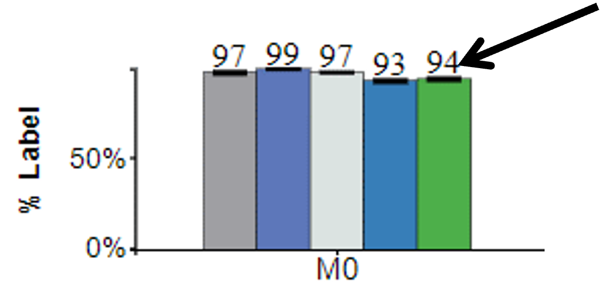
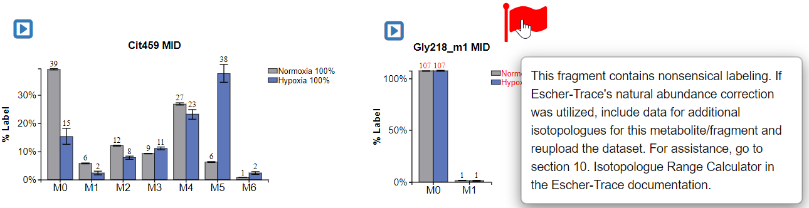

# 4. Alter graph attributes
This section of the documentation explains how to change the attributes of graphs including size, scheme, bar labels, legend metrics, presence of the context button, and plotting individual data points as well as show how to import these characteristics and others from a different Escher-Trace Workspace.

## 4.1 Changing Graph Size
Escher-Trace graphs can **all** be resized simultaneously. Below, is a walkthrough of how this is done.

### 4.1.0 Making Graph Size Pop-up Appear
After opening the **Graph Attributes** option, click **Size**.

While Hovering:

{: style='width:200px' }

After Click:

{: style='width:350px' }
 
To exit simply left click on the X in the top right

### 4.1.1 Change Height
Change the graph height by left clicking and dragging the gray circle slider underneath **Height**. Moving the slider to the right will make the dimension larger, moving left will make it smaller.

{: style='width:350px' }
 
### 4.1.2 Change Width
Change the graph width by left clicking and dragging the gray circle slider underneath **Width**. Moving the slider to the right will make the dimension larger, moving left will make it smaller.

{: style='width:350px' }
 
## 4.2 Changing Graph Color Scheme
The color scheme of **all** Escher-Trace graphs can be updated simultaneously. Below, is a walkthrough of how this is done.

### 4.2.0 Making Color Scheme Pop-up Appear
Click **Color Scheme**.

While Hovering:

{: style='width:200px' }
 
After Click:

{: style='width:650px' }
 
### 4.2.1 Selecting a Color Scheme
Simply click on the white circle next to the desired color scheme to select it.

{: style='width:650px' }
 
### 4.2.2 Change color entries
Click in any of the color input boxes and a color palette will appear.

{: style='width:650px' }
 
Click anywhere on the color palette to select the color as the value for the color input box. Alternatively, you can enter HEX color codes to select colors. 

### 4.2.3 Add colors to an Existing Color Scheme 
To add additional entries to an existing color scheme, click the "+" button located next to the color scheme you wish to add a new entry to. 
 
Before Click:
 
{: style='width:650px' }
 
After Click:
 
{: style='width:650px' }
 
 
### 4.2.4 Create a Custom Color Scheme
To add a completely new color scheme, click the Add New Color Scheme button.

Before Click:

{: style='width:650px' }

After Click:
 
{: style='width:650px' }

 
### 4.2.5 Submit or Abort Color Scheme
Click **Submit** to apply the color scheme changes or abort by clicking the X in the top right.

Submit: 
 
{: style='width:650px' }
 
Before Submit: 

{: style='width:400px' }
 
 
After Submit:

{: style='width:450px' }
 
Abort:
 
  {: style='width:650px' }
 
## 4.3 Remove/Add Bar Labels
Bar labels can appear on graphs of labeling and enrichment. Below is a walkthrough of how to add/remove bar labels from Escher-Trace graphs.

Click the toggle button next to **Bar Labels** to change the option.

{: style='width:200px' }

Before Click:

{: style='width:250px' }

After Click:

{: style='width:250px' }
 

 
## 4.4 Remove/Add Legend Metrics
Legend metrics can appear in graphs of mass isotopologue distributions. The metric shown is equal to the sum of the isotopologue fractions across all displayed isotopologues for a specific metabolite and condition. It can be utilized to quickly get a sense of labeling data quality, values differing from 100% suggest improper metabolite integration and/or natural isotope correction and will appear red. Additionally, graphs containing data with a legend metric value other than 100% or which contain individual isotopologue labeling >100% or <0% (which can occur due improper natural isotope correction) will be flagged.

Below is a walkthrough of how to add/remove legend metrics from Escher-Trace graphs.

Click the toggle button next to **Legend Metrics** to change the option.

{: style='width:200px' }

Before Click:

{: style='width:500px' }
 
After Click: 

{: style='width:500px' }

Hover over Flag:

{: style='width:650px' }
 

## 4.5 Remove/Add Context Button
Context Buttons provide an alternative method, besides right-clicking, for accessing the context menu of an Escher-Trace graph context menu for individual graph editing and [more]. When visible, clicking the context button will make the graph context menu appear. These buttons can be useful on devices where right clicking is not possible. Below is a walkthrough of how to add/remove context buttons from Escher-Trace graphs.

Click the toggle button next to **Context Button** to change the option.

{: style='width:200px' }

Before Click:

{: style='width:400px' }
 
After Click: 

{: style='width:400px' }

## 4.6 Remove/Add Individual Data Point Labels
Labels for individual sample data points are required for figures in some academic journals and provide an extra layer of information in scientific plots. Individual data labels can appear in any non-stacked format Escher-Trace graph. Below is a walkthrough of how to add/remove individual data point labels from Escher-Trace graphs.

Click the toggle button next to **Plot Individual Data** to change the option.

{: style='width:200px' }

Before Click:

{: style='width:600px' }
 
After Click: 

{: style='width:600px' }

## 4.7 Import Settings from a Different Escher-Trace Workspace
Escher-Trace settings are stored in saved workspace JSON files. Below is a walkthrough of how to import various settings from any saved Escher-Trace workspace to your current workspace. The following Escher-Trace settings can be imported:

+ **Graph Locations:** What data and datatypes are graphed and where they appear on the Escher-Map. 
+ **Graph Aesthetics:** The size, color schemes, axis labels, and titles of Escher-Trace graphs as well the bar label, legend metrics, context button, and individual data point label toggle settings.
+ **Isotopologues Displayed:** Entries from the [Isotopologues to Display table](../DataDisplayed/#52-isotopologues-to-display).
+ **Quantitative Standards:** Entries from the [Quantitative Standards table](../Analysis/#64-quantify-metabolite-abundances).
+ **Labeling Diagrams:** [Circle diagrams](../DataDisplayed/#53-create-carbon-diagram) used to summarize points about labeling. 

**Note:** Selection of any of these options will remove any preset values associated with the option.

Click **Import Workspace Settings**.

{: style='width:200px' }

Click "Choose File" and select the Escher-Trace workspace file whose settings you would like to import.

{: style='width:400px' }

Then select the settings you would like to import to your current Escher-Trace workspace by ticking the adjacent box. When all selections are made click **Submit Form**.

{: style='width:400px' }

Before Submit:

{: style='width:650px' }

After Submit:

{: style='width:650px' }

