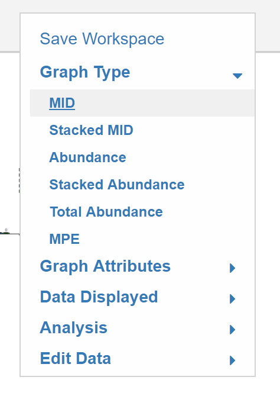
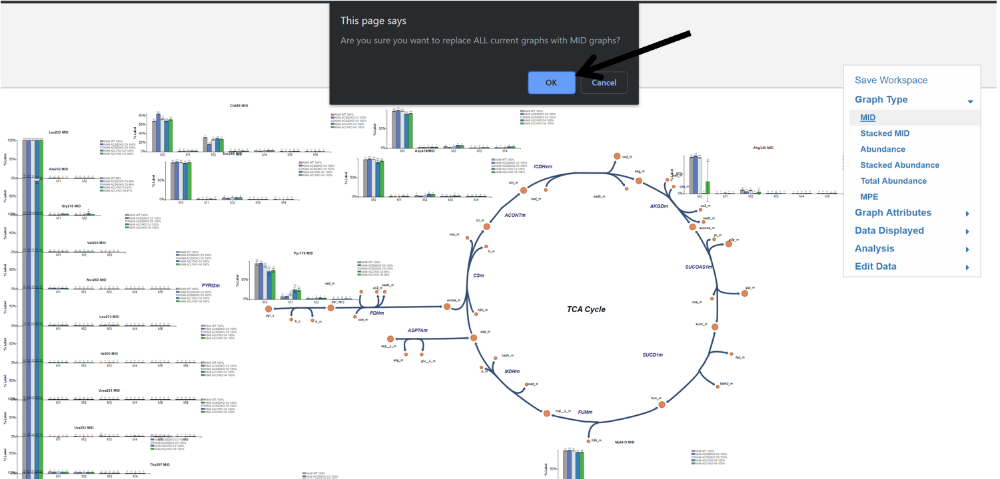

# 3. Changing the Displayed Graph Type
This portion of the guide will explain how to switch graphs for all metabolites to one the following options: MID, Stacked MID, Abundance, Stacked Abundance, MPE. These options can be accessed by clicking **Graph Type** in the Escher-Trace Menu

## 3.1 Selecting the Type of Graph
To choose the graph type simply click on the name of the specific type.

While Hovering:
 
{: style='width:200px' }

After selecting an option, an alert will appear asking you to confirm that you wan't all current graphs to be replaced with the selected graph type. Click OK and all Escher-Trace graphs on the Escher Map will be replaced with the selected graph type, otherwise click Cancel.
 

