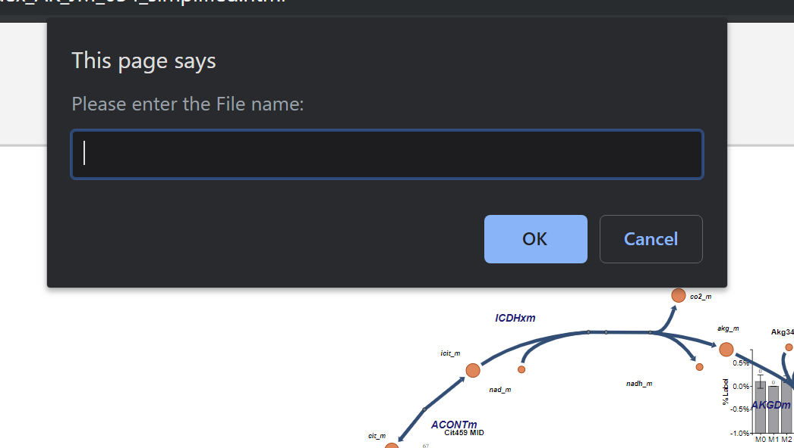
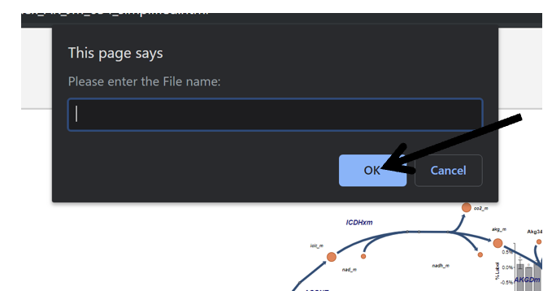

# 8. Save Workspace
This section of the documentation explains how to save your Escher-Trace workspace.

**NOTE:** The Escher-Trace Workspace JSON data file that is generated by saving your workspace only includes information relating to your metabolite data and graphs, if changes were made to the Escher Map, it will need to be saved and reuploaded separately to recreate your Escher and Escher-Trace workspace. Information on how to save and reupload an Escher map can be found [here.](https://escher.readthedocs.io/en/latest/getting_started.html#loading-and-saving-maps)
 
## 8.1 Make Option Appear
Click on **Save Workspace**:

After Click:

{: style='width:500px' }

## 8.2 Choose File Name
Type the desired file name into pop-up message and left click OK.

{: style='width:500px' }
 
After Click: A file with the entered name will be downloaded to your device. 

## 8.3 Reupload Escher-Trace Workspace
To reupload your Escher-Trace workspace, after reopening Escher-Trace and clicking **Import Tracing Data** as described [here](../GettingStarted/#132-loading-data-in), and upload the downloaded JSON file.