# 6. Analysis 
This portion of the guide will explain how to normalize conditions, compare individual metabolites, enter time points, and enter quantitative standards.

## 6.1 Compare Metabolites
This button allows the user to generate graphs directly comparing metbolite abundance, enrichment, or individual isotopologue labeling across metabolites and conditions.

### 6.1.0 Make the Compare Metabolites Pop-up Appear
Make the options appear by clicking the **Compare Metabolites** button:

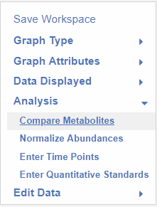{: style='height:200px' }

After click:
 
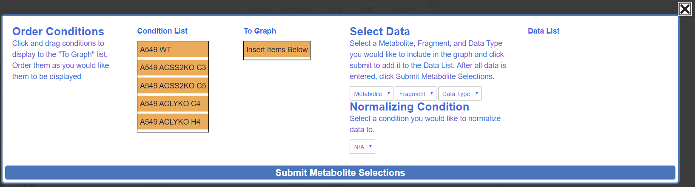

### 6.1.1 Select which Conditions
First the user needs to click and drag each condition they want included in the graph below the area that says **To Graph**. 

 
Wait for the blue rectangle to appear then let go:

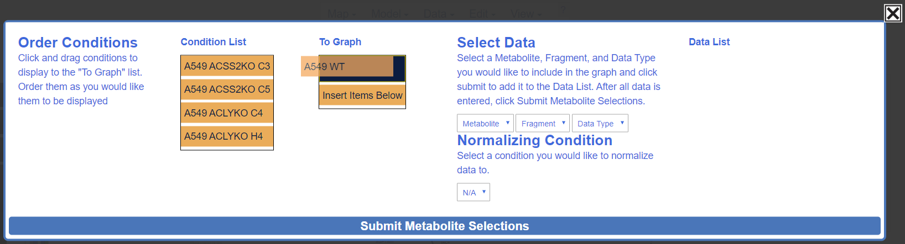

Items can move back and forth between **Condition List** and **To Graph**, if the user changes their mind.

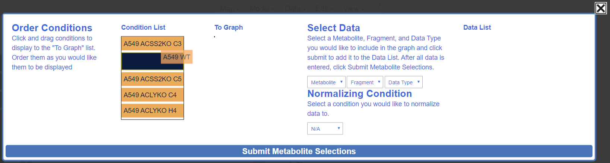
 
### 6.1.2 Data List
Next, the user needs to select the metabolite, fragment, and data type they want to include in the graph. All three are handled by a drop down menu.

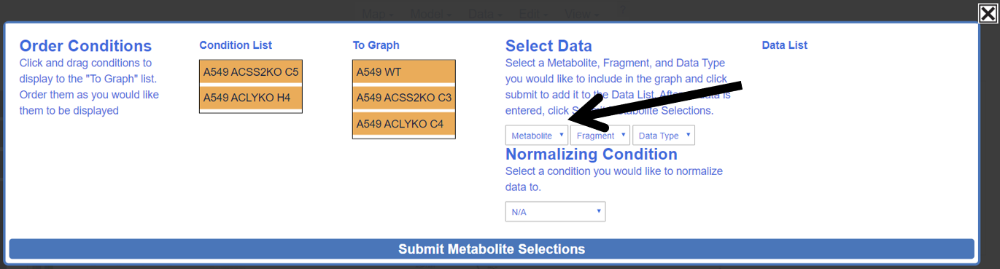
 
Make the selections for each type:

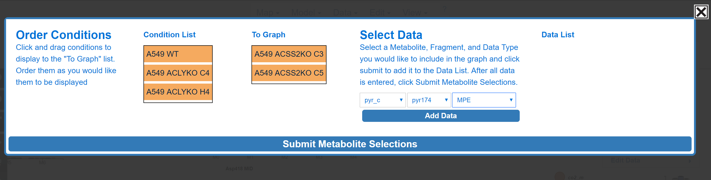
 
As shown a button labeled **Add Data** will appear once all three options are selected.

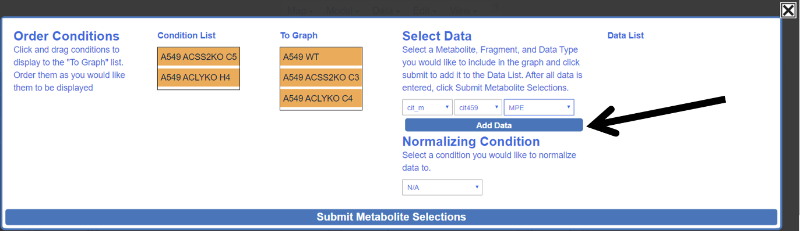
 
Click **Add Data** to add the data entry to the data list:

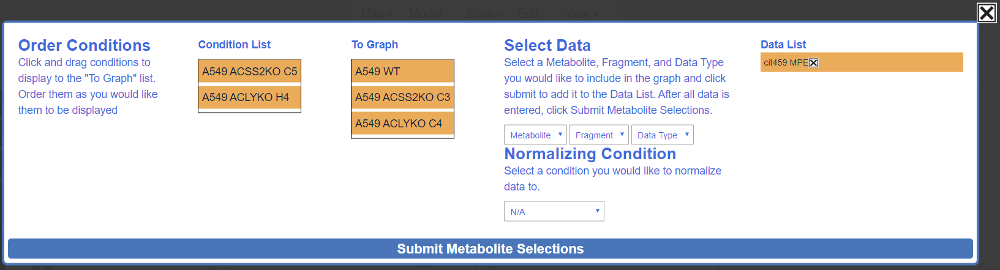
 
Add more metabolite-fragment-data type combinations by performing the drop down menu selections again.

### 6.1.3 Submit or Abort Changes
Submit your selections by clicking **Submit Metabolite Selections** to generate a graph of the specified data across the specified condition, or abort selections by clicking the X in the top right.

Submit:

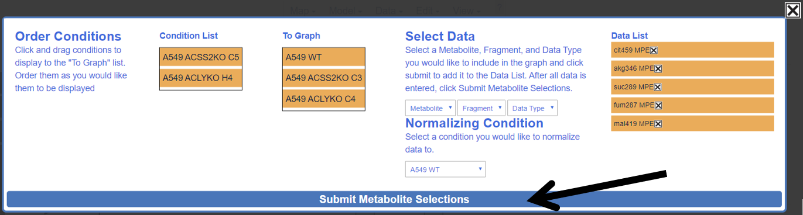

Generating a new graph in the top left corner of the Escher Map

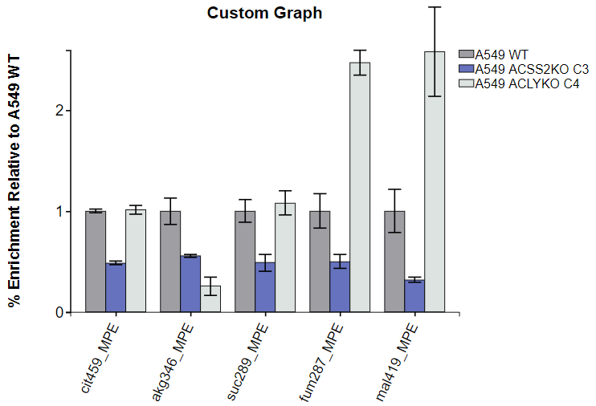{: style='height:250px' }

The graph title, y-axis, and x-axis label text can be edited by clicking them

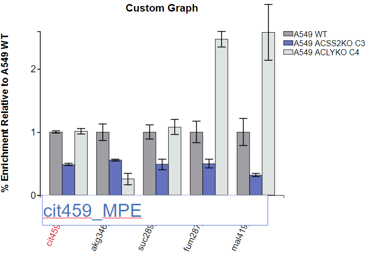{: style='height:250px' }

After edits:

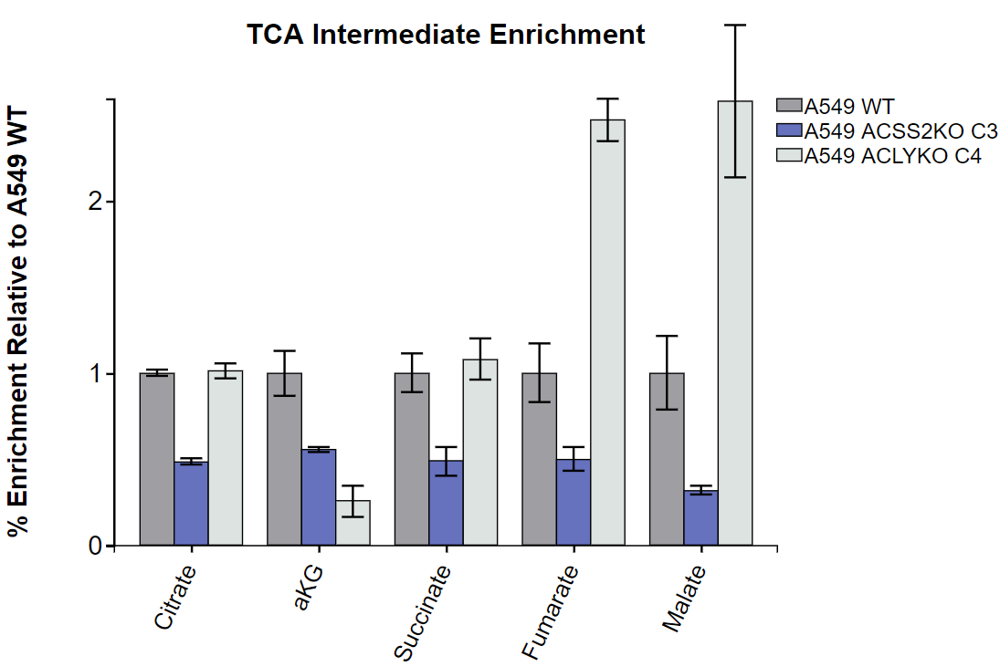{: style='height:250px' }

Abort:

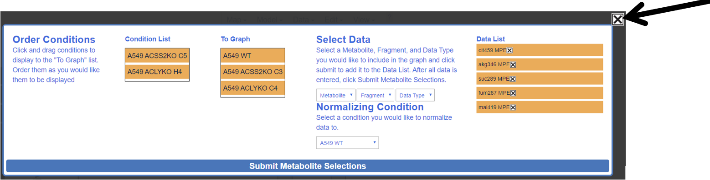

## 6.2  Normalize Abundances
This button allows the user to normalize metabolite abundances to a specific experimental condition, an internal standard (metabolite) and/or by cell numbers/sample mass.
    
### 6.2.0 Make Normalize Abundances Pop-up Appear
Click **Normalize Abundances** and left click to make the menu appear.

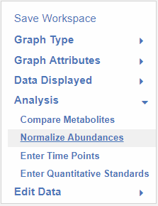{: style='height:200px' }

After click:

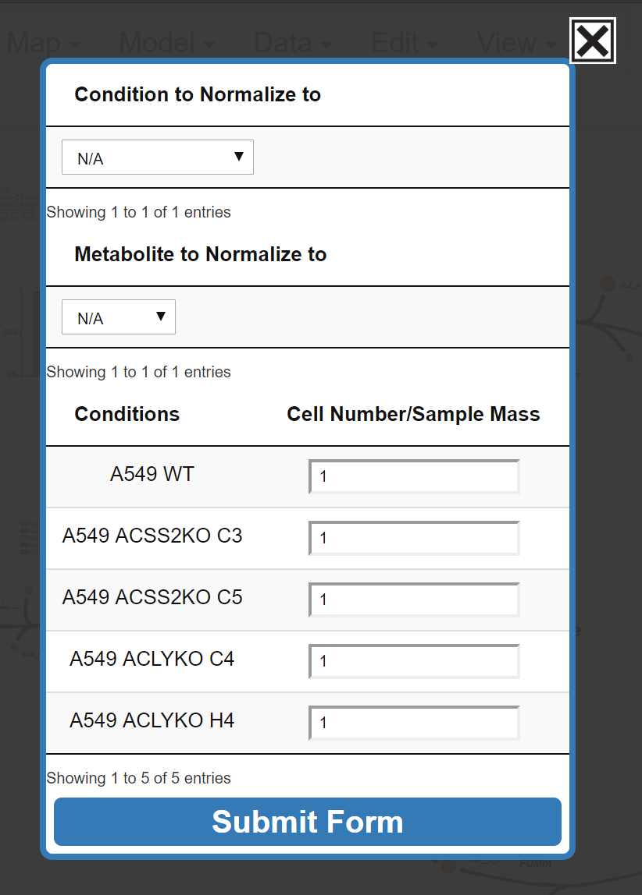{: style='width:300px' }
 
### 6.2.1 Condition to Normalize to
Click the drop down menu and select the group that you would like all metabolite abundances to normalized to. The default selection is N/A, meaning abundances will not be normalized to a specific condition. A common selection for this option would be the wild-type or control condition of your study.

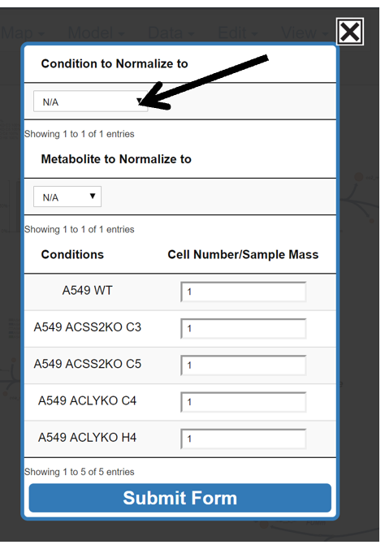{: style='width:300px' }
 

### 6.2.2 Metabolite to Normalize to
Select an individual metabolite to normalize all metabolite abundances to by clicking the drop down menu and selecting the metabolite. The default selection is N/A, meaning abundances will not be normalized to a specific metabolite/fragment. A common selection for this option would be an internal standard included in all samples.

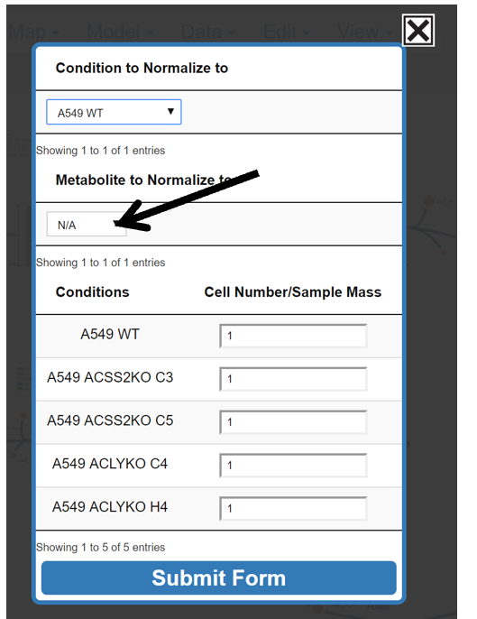{: style='width:300px' }
 
After Click:

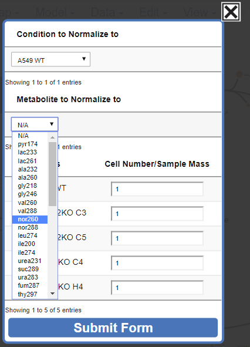{: style='width:300px' }
 
Scroll through until you find the desired metabolite and click it. 

### 6.2.3 Enter Cell Number/Sample Mass for Each Group 
Enter the measured cell number or sample for each group by clicking the white box adjacent to each group and typing the appropriate value. The default selection is 1, meaning abundances will not be normalized.

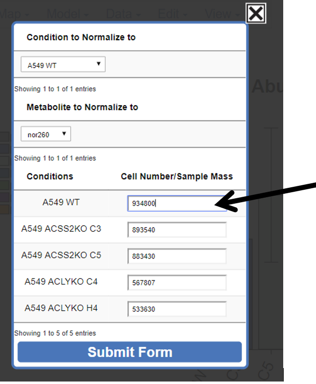{: style='width:300px' }

 
### 6.2.4 Submit or Abort Changes
Submit your selections by clicking **Submit Form** or abort changes by clicking the X in the top right. If submitted, all abundance graphs will be reprinted with the normalization parameters applied.

Submit: 

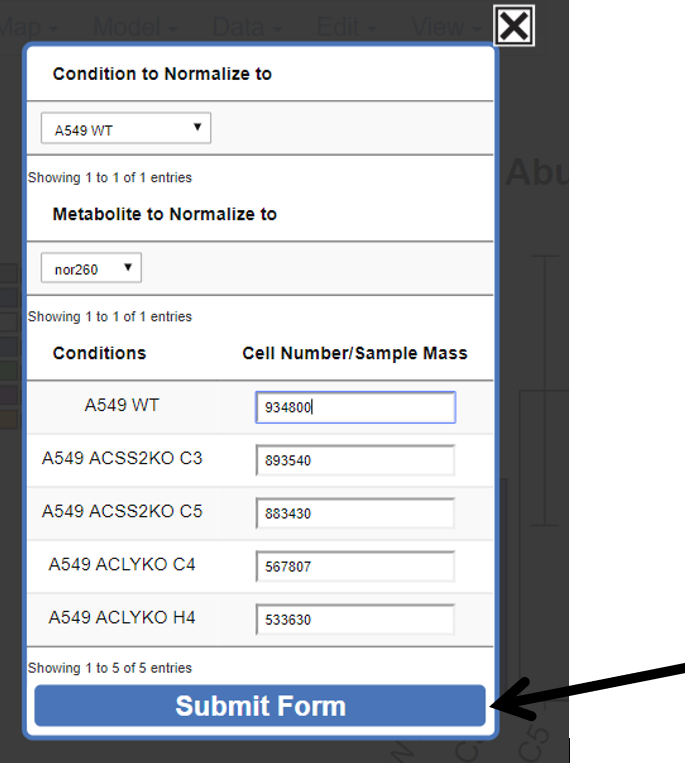{: style='width:350px' }
 
Before Submit:

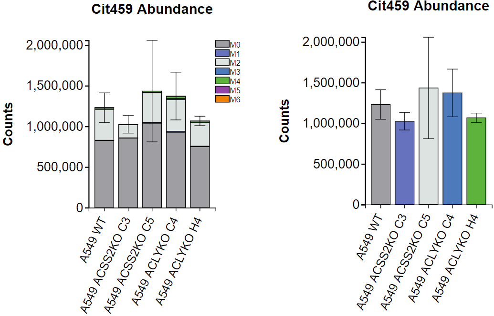{: style='width:400px' }
 
After Submit:

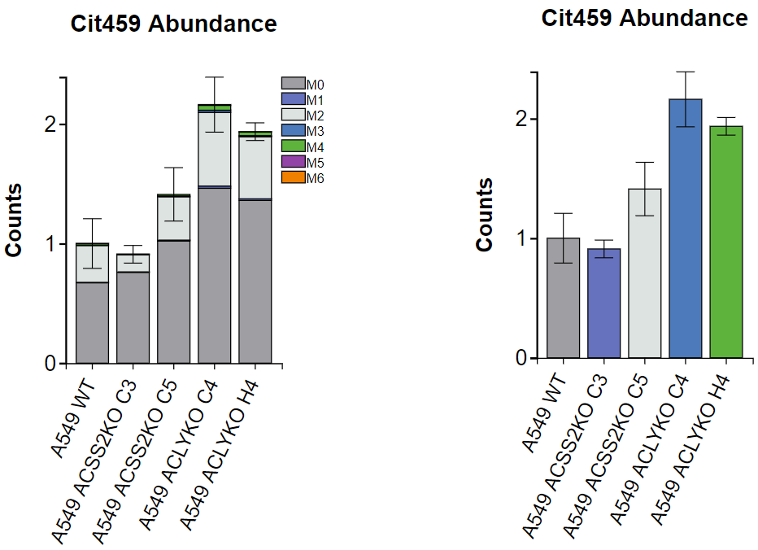{: style='width:400px' }
 
Abort: 

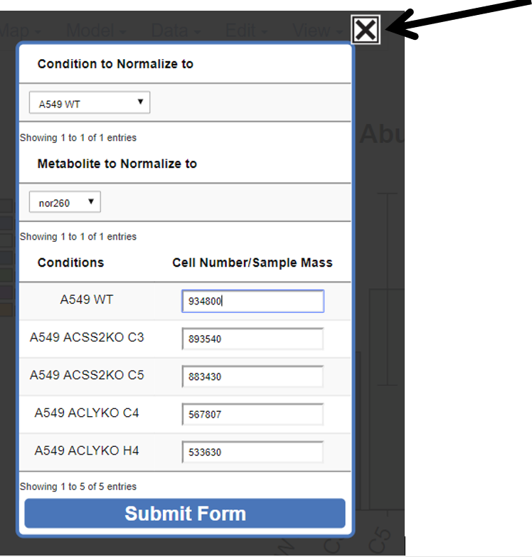{: style='width:400px' }
 
## 6.3 Enter Time Points
This button allows the user to enter time point information allowing for creation of kinetic (time-course) graphs for single isotopologues, metabolite abundances, and mole percent enrichment of a metabolite.

### 6.3.0 Make Enter Time Points Pop-up Appear
Click the **Enter Time Points** button.

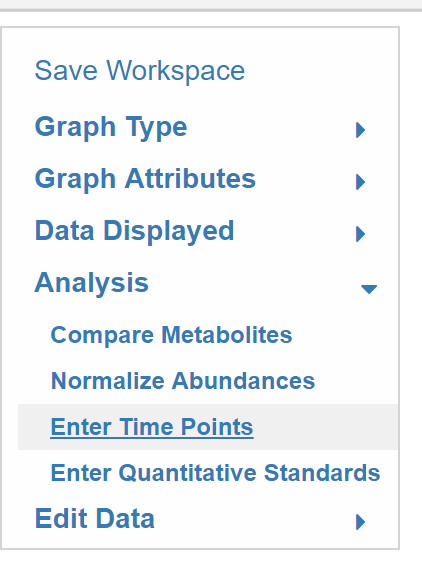{: style='width:200px' }
 
After Click:

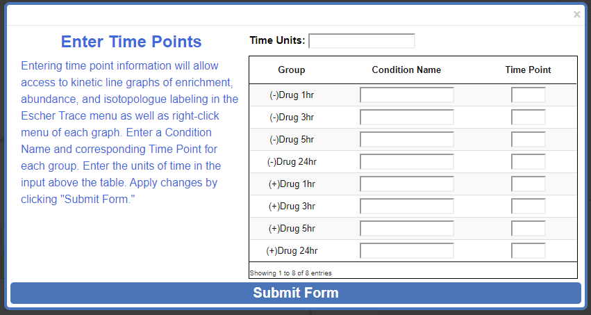{: style='width:600px' }
 
### 6.3.1 Enter Time Units
Click in the white box next to **Time Units** and type the unit of time i.e. seconds, minutes

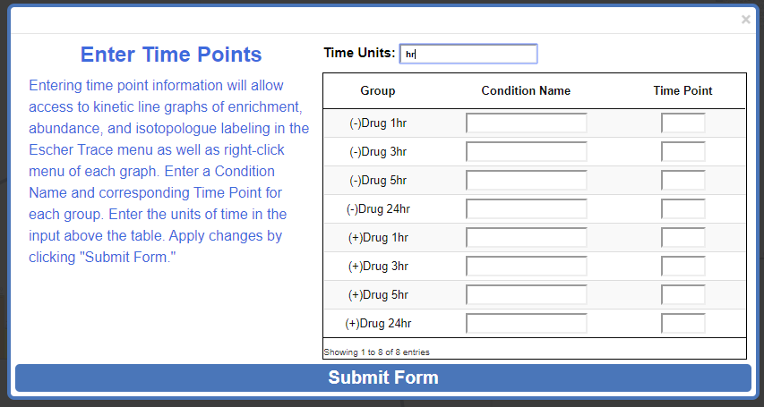{: style='width:600px' }
 
### 6.3.2 Enter Condition Name
Click in the white box below **Condition Name** and type the desired name for each group.

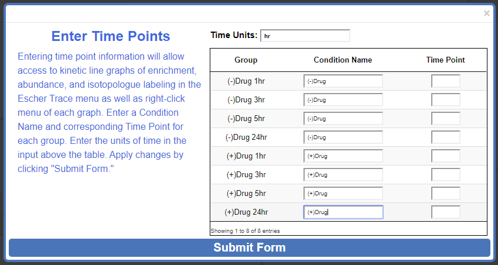{: style='width:600px' }
 
### 6.3.3 Enter Time Point
Click in the white box below **Time Point** and type the desired time point for each group.

{: style='width:600px' }
 
### 6.3.4 Submit or Abort Changes
Submit the selections by clicking **Submit Form** or abort changes by clicking the X in the top right. If the form was filled out correctly, submission will cause additional graph types (Kinetic Abundance and Kinetic MPE) to appear in the Escher-Trace Menu under **Graph Type**. Additionally these options will appear in the context menu's for each graph (acessed by right-clicking a graph). The kinetic graph of an individual isotopologue can be accessed by selecting the desired isotopologue on the x-axis of an MID graph.

Submit:

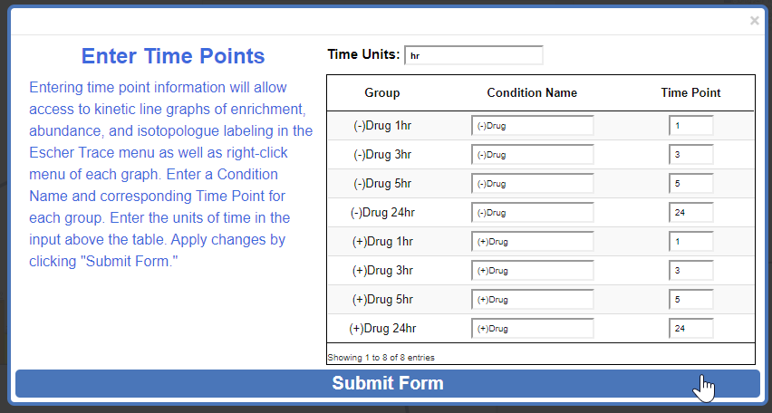{: style='width:600px' }

### 6.3.5 Order Kinetic Conditions
Click and drag conditions from **Condition List** to **To Graph** in the order you will want them displayed. 

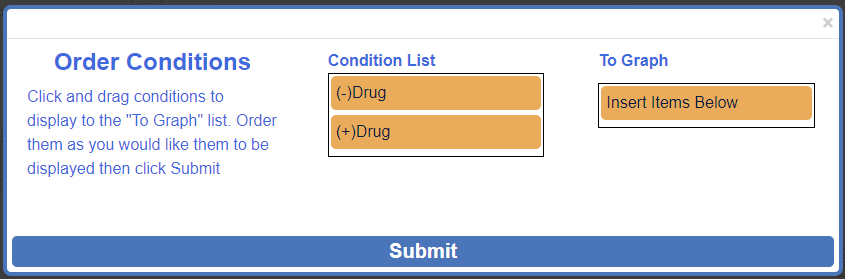{: style='width:600px' }

Submit

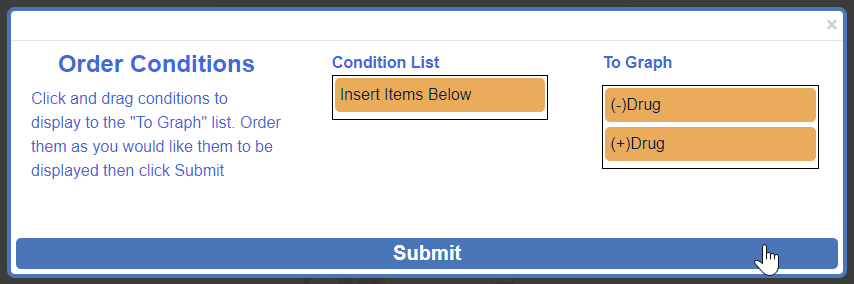{: style='width:600px' }

### 6.3.6 Acessing Kinetic Graphs
To access line graphs of time course data, the user can access kinetic graph options in the Escher menu under graph type:

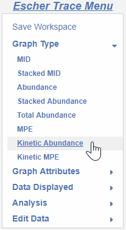{: style='width:200px' }

or can access the graphs by right clicking existing Escher-Trace graphs:

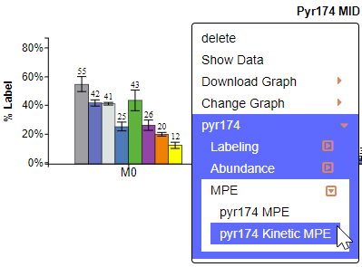{: style='width:400px' }

Kinetic graphs of single isotopologue labeling, enrichment, and abundance look like the following:

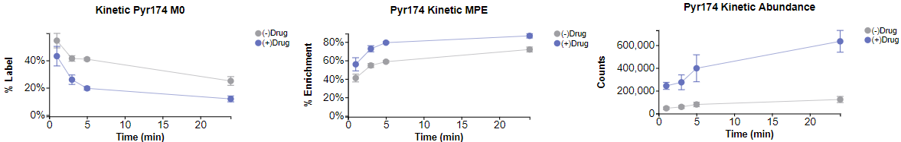

 
## 6.4 Enter Quantitative Standards
This portion of the user guide will explain how to input quantitative standards into Escher-Trace to allow for absolute quantitation of metabolites. Quantitation is be performed by taking the ratio of the unlabeled counts (M0) over the counts of the spiked labeled standard, as indicated by the user, and multiplying by the concentration of the spiked standard in the sample. Ratios are taken within each data file, and averaged across files within the same condition group.

### 6.4.0 Making Quantitative Standards Pop-up Appear
Click the **Enter Quantitative Standards** button:

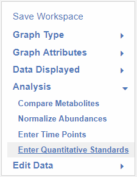{: style='width:200px' }

After Click:

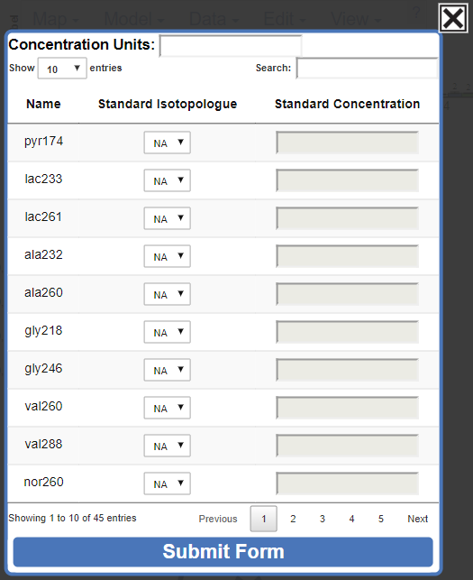{: style='width:450px' }
 
For general understanding of how to use the table see [here.](../DataDisplayed/#511-make-the-options-appear)

### 6.4.1 Concentration Units
Click the white box next to **Concentration Units** and enter in the units of concentration that will be used for the spiked standard. 

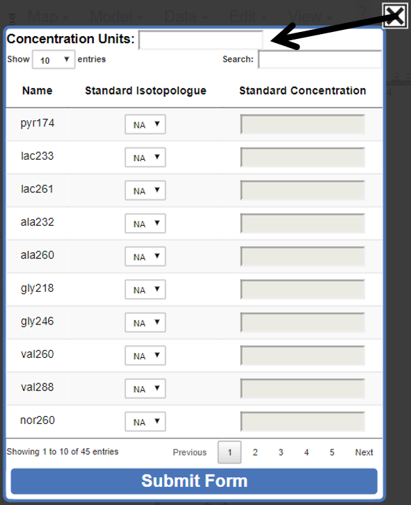{: style='width:450px' }
 
### 6.4.2 Standard Isotopologue
Select the isotopologue that corresponds to the spiked standard by clicking the drop down menu next to the desired metabolite and selecting the specific isotopologue.

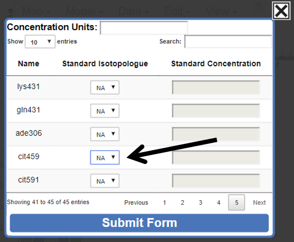{: style='width:450px' }

After Click:

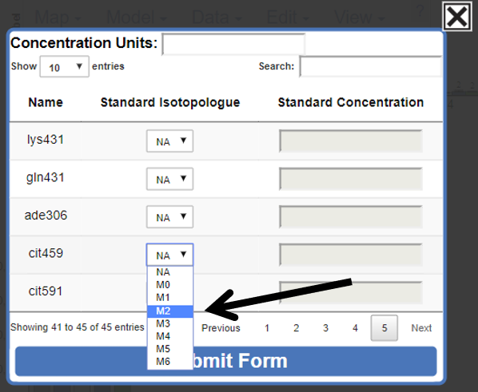{: style='width:450px' }
 
Left click on desired isotopologue. 

### 6.4.3 Standard Concentration
Input standard concentration by left clicking on the white box located below **Standard Concentration** and adjacent to the corresponding metabolite. The **Standard Concentration** input will only be selectable if a **Standard Isotopologue** selection other than NA is selected.

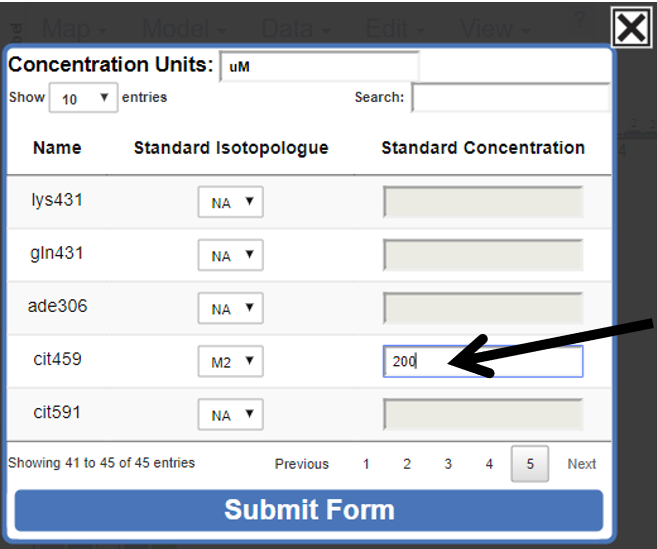{: style='width:450px' }

 
### 6.4.4 Submit or Abort Changes
To submit changes left click **Submit Form** to abort changes left click on the X in the top right.

Submit:

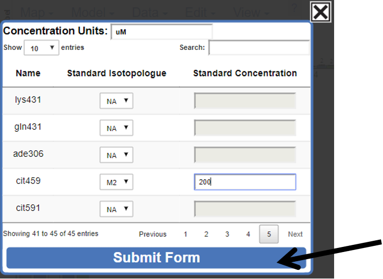{: style='width:450px' }
 
Before Submit:

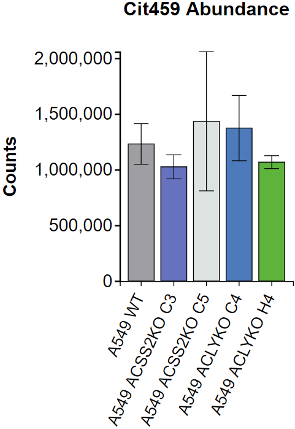{: style='width:250px' }

After Submit:

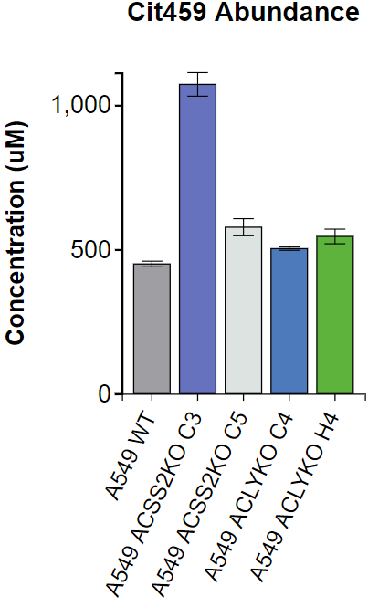{: style='width:220px' }

Abort:

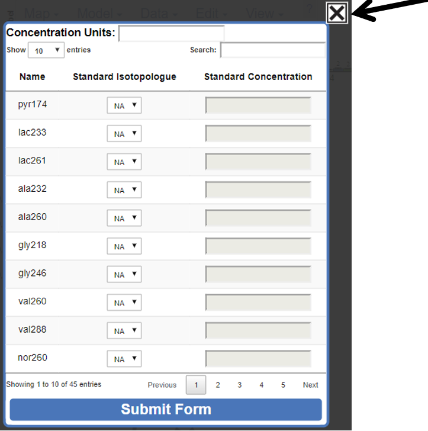{: style='width:450px' }