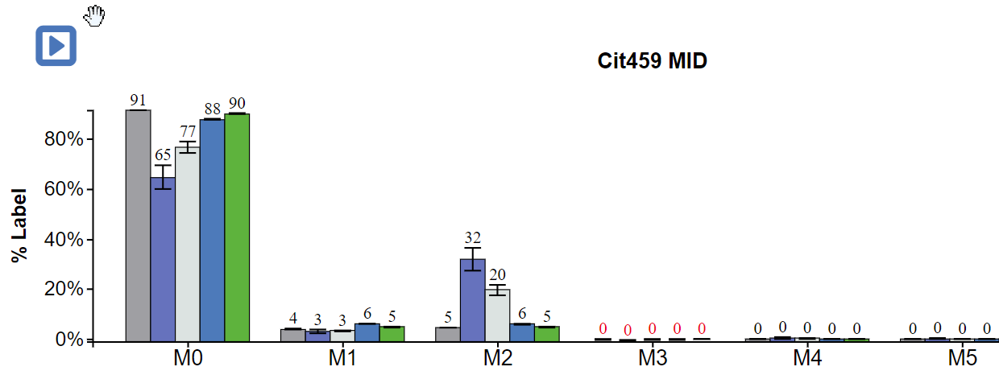
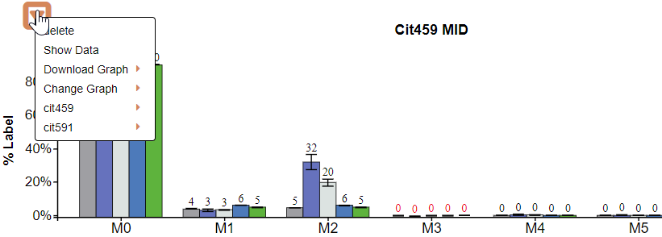
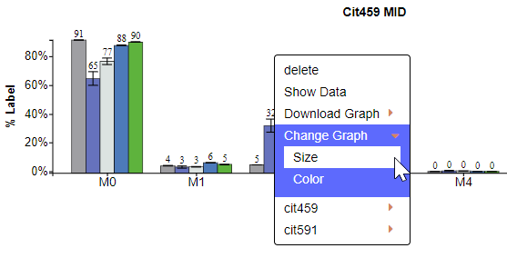
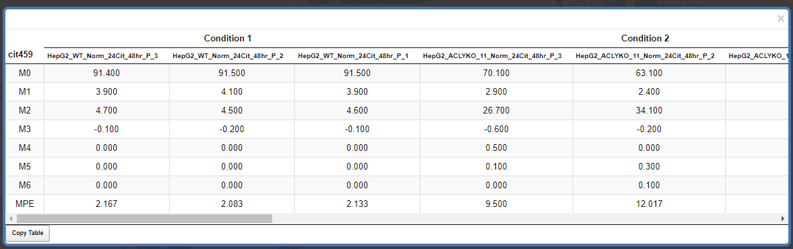
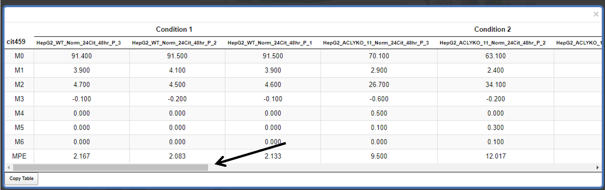
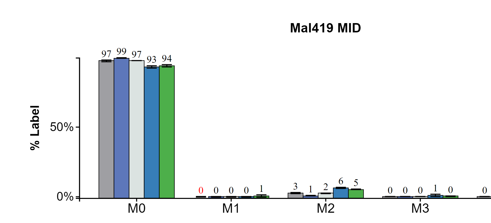

# 2. Edit Individual Graphs
Individual graphs generated by Escher-Trace can be edited, downloaded, or used to access additional data associated with the graphed metabolite. Additionally, title and y-axis label text can be altered by clicking on either and typing the desired name. These processes apply to all Escher-Trace graphs, not just the ones shown below.

## 2.1	Access Additional Graph Options

There are two methods to access additional options for individual graphs. These options include **Delete**, **Show Data**, **Download**, **Change Graph**, and multiple fragments of the individual metabolite if applicable. These operations apply only to the graph/metabolite that was selected.

**Method 1:** Left click on the menu triangle located in the top left hand corner of all graphs

Before clicking menu triangle:

{: style='width:500px' }

After clicking menu triangle:
 
{: style='width:500px' }

**Method 2:** Right click anywhere on a graph

After Right Clicking on a graph:

{: style='width:500px' }

To get rid of the dropdown menu simply click away from the graph and menu.

## 2.2	Delete Graph
To delete a graph, click on **delete** after making the dropdown menu appear.

{: style='width:500px' }
 
## 2.3	Downloading an Individual Graph
After making the dropdown menu appear click on **Download** then select the file type you want to download the graph as, either **SVG** or **PNG**.
 
 {: style='width:500px' }
 
## 2.4	Change the Graph Aesthetics
After clicking on **Change Graph** additional options will appear allowing you to change the size and color scheme of the individual graph.

### 2.4.1	Change Graph Size
Click on **Size** to make the Graph Size pop-up appear.

{: style='width:500px' }

Interact with the Graph Size pop-up as described [here.](../GraphAttributes/#41-changing-size)

### 2.4.2	Change Graph Color Scheme
Click on **Color** to make the Color Scheme pop-up appear.

 {: style='width:500px' }

Interact with the Color Scheme pop-up as described [here.](../GraphAttributes/#421-selecting-the-graph-color-scheme)
 
## 2.5	Access additional Graph Types for this Metabolite
The last option allows you to select a different graph type for specifically the selected metabolite. Simply click on the metabolite/fragment name then click the desired graph type and that graph will appear.

{: style='width:500px' }
 
After Click:
 
 {: style='width:500px' }
 
## 2.6	Show Data
Click on **Show Data** to view the data used to generate the selected graph.

{: style='width:500px' }
 
After Click:

 

Scroll through the data using the bar at the bottom of the table:

Copy the Table:

 
Close the Table: 
 

## 2.7	Changing Graph Title or Y-axis Label
To edit the graph title or y-axis label of a graph, first: hover over the text and it will turn red, then left click.

Before Hover:

{: style='width:500px' }

After Hover:

{: style='width:500px' }

After Click:

{: style='width:500px' }
 
Change the text in the text input. Move through the text input with arrow keys and delete with backspace. When the desired name is entered press enter.

## 2.8	Generating Graphs for Individual Isotopologues
There are two methods to generate graphs of specific isotopologues (e.g M0, M1, etc.)

**Method 1:** Click on the desired isotopologue on the x-axis, for M0 click M0.

NOTE: This option is only available for MID graphs.

When Hovering:

{: style='width:500px' }

**Method 2:** Access individual isotopologues from the context menu of any Escher-Trace graph.

{: style='width:500px' }

After Click:
 
{: style='width:500px' }

## 2.9	Moving the Graphs
To move the graphs simple hover over the graph click and hold then drag to desired location.
