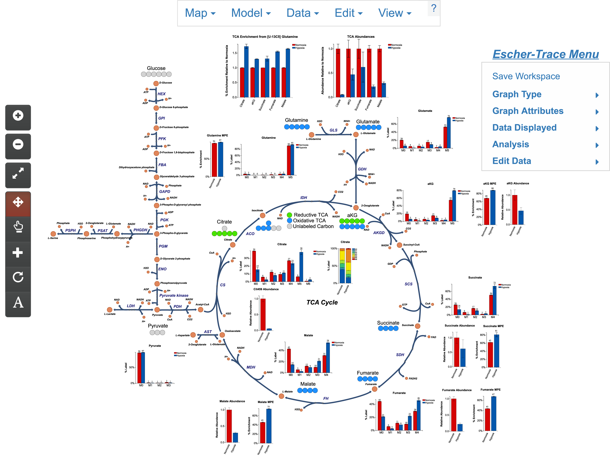
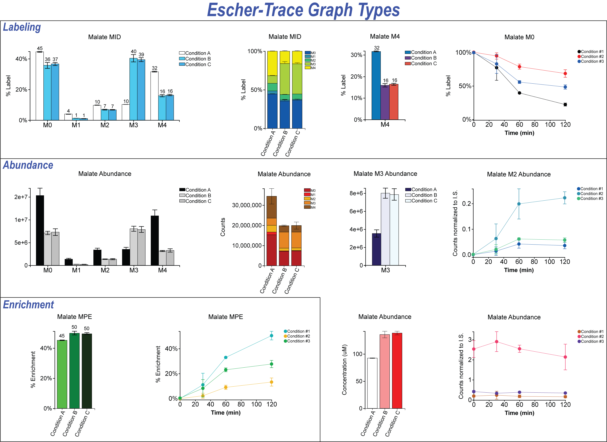

# Welcome to Escher-Trace

Escher-Trace is a tool for visualizing and analyzing stable isotope tracing data. You can find more information about how to use the tool by selecting from the menu options on the left. Escher-Trace is built on top of [Escher.](https://escher.github.io/#/) New users may be interested in the [**Getting Started with Escher-Trace**](GettingStarted) guide. 

## Features
1. Upload data in a simple JSON or CSV [format](GettingStarted/#13-importing-tracer-data)
2. Correct isotopic labeling for [natural isotope abundance](Calculations/#91-natural-isotope-abundance-correction)
3. Automatically generate publication quality graphs of:
    - Mass isotopomer distribution
    - Metabolite abundance
    - Mole percent enrichment
    - [Kinetic labeling and abundance](Analysis/#63-generate-time-series-graphs)   
4. [Export graphs in svg format](EditIndivGraphs/#24-downloading-an-individual-graph), allowing for seamless integration with vector graphics editors (such as Adobe Illustrator).
5. Full control over [data normalization](Analysis/#62-normalize-metabolite-abundances) and [sample/condition grouping](EditData)
6. [Save and reload your workspace](SaveWorkspace) so you can start and stop analysis or easily transfer data to collaborators.
7. Integration with Escher maps, allowing for simple loading and editing of pathway maps.

## Supported browsers
We recommend using Google Chrome for the best user experience, however Escher-Trace will also run on Internet Explorer, Firefox, and Safari as well as mobile browsers.

## Citing Escher-Trace
Coming Soon.
